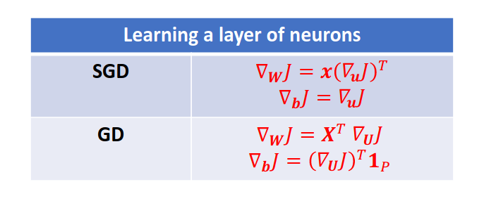
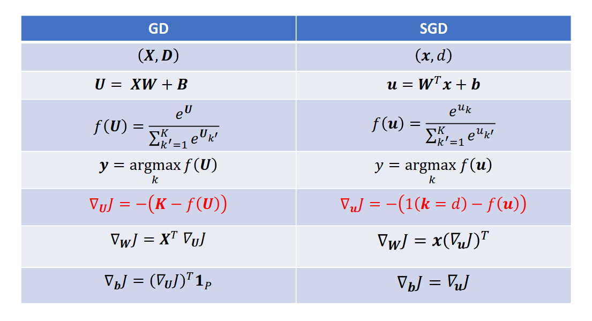

- [Neuron Layer](#neuron-layer)
  - [Weight matrix of a layer](#weight-matrix-of-a-layer)
  - [Synaptic input at a layer for single input](#synaptic-input-at-a-layer-for-single-input)
  - [Synaptic input to a layer for batch input](#synaptic-input-to-a-layer-for-batch-input)
  - [Activation at a layer for batch input](#activation-at-a-layer-for-batch-input)
  - [SGD for single layer](#sgd-for-single-layer)
  - [GD for single layer](#gd-for-single-layer)
  - [Conclusion for Neuron Layer](#conclusion-for-neuron-layer)
- [Perceptron Layer](#perceptron-layer)
  - [SGD for perceptron layer](#sgd-for-perceptron-layer)
  - [GD for perceptron layer](#gd-for-perceptron-layer)
  - [Conclusion for Perceptron Layer](#conclusion-for-perceptron-layer)
- [Softmax Layer](#softmax-layer)
  - [SGD for softmax layer](#sgd-for-softmax-layer)
  - [GD for softmax layer](#gd-for-softmax-layer)
  - [Conclusion for softmax layer](#conclusion-for-softmax-layer)
- [Initialization of weights](#initialization-of-weights)
  - [Initialization from a uniform distribution](#initialization-from-a-uniform-distribution)
  - [Initialization from a truncated normal distribution](#initialization-from-a-truncated-normal-distribution)

# Neuron Layer
A Layer of perceptrons performs **multidimensional linear regression** and learns a multidimensional linear mapping:
$$\phi: \mathbb{R}^n \rightarrow\mathbb{R}^K$$
## Weight matrix of a layer
Consider a layer of K neurons:

Let $\mathbf{W_k}$ and $b_k$ denote the weight vector and bias of $k$ th neuron. Weights connected to a neuron layer is represented by a weight matrix $\mathbf{W}$ where the columns are given by weight vectors of individual neurons:
$$\mathbf{W} = (\mathbf{w_1}\quad\mathbf{w_2}\quad\dots\quad\mathbf{w_k})$$
and a bias vector $\mathbf{b}$ where each element corresponds to a bias of a neuron:
$$\mathbf{b} = (b_1, b_2, \dots, b_K)^T$$
## Synaptic input at a layer for single input
Given an input pattern $x\in \mathbb{R}^n$ to a layer of $K$ neurons. The synaptic input $u_k$ to $k$ th neuron is:
$$u_k = \mathbf{w}_k^T\mathbf{x}+ b_k$$
where $\mathbf{w}_k$ and $b_k$ denote the weight vector and bias of $k$th neuron. Synaptic input vector $u$ to the layer is:
$$\mathbf{u} = \left(\begin{array}{cc}
    u_1\\u_2\\\vdots\\u_k
\end{array}\right) = \left(\begin{array}{cc}
    \mathbf{w}_1^T\mathbf{x} + b_1\\
    \mathbf{w}_2^T\mathbf{x} + b_2\\
    \vdots\\
    \mathbf{w}_k^T\mathbf{x} + b_k
\end{array}\right) = \left(\begin{array}{cc}
    \mathbf{w}_1^T\\
    \mathbf{w}_2^T\\
    \vdots\\
    \mathbf{w}_k^T\\
\end{array}\right)\mathbf{x} + \left(\begin{array}{cc}
    b_1\\b_2\\\vdots\\b_k
\end{array}\right) = \mathbf{W}^T\mathbf{x} + \mathbf{b}$$
where $\mathbf{W}$ is the weight matrix and $\mathbf{b}$ is the bias vector of the layer.

## Synaptic input to a layer for batch input

Given a set $\{\mathbf{x}_p \}_{p=1}^P$ input patterns to a layer of $K$ neurons where $\mathbf{x}_p\in \mathbb{R}^n$.

Synaptic input $\mathbf{u}_p$ to the layer for an input pattern $\mathbf{x}_p$ is:
$$\mathbf{u}_p = \mathbf{W}^T\mathbf{x}_p + \mathbf{b}$$
The synaptic input matrix $\mathbf{U}$ to the layer for P patterns:
$$\mathbf{U} = \left(\begin{array}{cc}
    \mathbf{x}_1^T\mathbf{W} + \mathbf{b}^T\\
    \mathbf{x}_2^T\mathbf{W} + \mathbf{b}^T\\
    \vdots\\
    \mathbf{x}_P^T\mathbf{W} + \mathbf{b}^T
\end{array}\right) = \left(\begin{array}{cc}
    \mathbf{x}_1^T\\
    \mathbf{x}_2^T\\
    \vdots\\
    \mathbf{x}_P^T
\end{array}\right)\mathbf{W} + \left(\begin{array}{cc}
    \mathbf{b}^T\\\mathbf{b}^T\\\vdots\\\mathbf{b}^T
\end{array}\right) = \mathbf{XW} + \mathbf{B}$$
where rows $\mathbf{U}$ are synaptic inputs corresponding to individual input patterns.

The matrix 
$$\mathbf{B} = \left(\begin{array}{cc}
    \mathbf{b}^T\\\mathbf{b}^T\\\vdots\\\mathbf{b}^T
\end{array}\right)$$ 
has bias vector propagated as rows.

Using batch in deep learning could accerate the speed of training.

## Activation at a layer for batch input

Activation of the layer of synaptic input to the layer due to a batch of patterns:

$$f(\mathbf{U}) = \left(\begin{array}{cc}
    f(\mathbf{u}_1^T) \\ f(\mathbf{u}_2^T) \\\vdots \\f(\mathbf{u}_P^T)
\end{array}\right) = \left(\begin{array}{cc}
    f(\mathbf{u}_1)^T\\
    f(\mathbf{u}_2)^T\\
    \vdots\\
    f(\mathbf{u}_P)^T
\end{array}\right)$$
where activation of each pattern is written as rows.

## SGD for single layer
Computational graph for processing input $(\mathbf{x}, \mathbf{d})$:

$J$ denotes the cost function. Now, we need to compute gradients $\nabla_\mathbf{W}J$ and $\nabla_\mathbf{b}J$ to learn the weight matrix $\mathbf{W}$ and the bias vector $\mathbf{b}$.

Consider $k$th neuron at the layer:
$$u_k = \mathbf{w}_k^T\mathbf{x} + b_k = \sum_{i=0}^nw_{ki}x_i + b_k$$
where n is the rank of $\mathbf{x}$. So that
$$\begin{aligned}
    &\frac{\partial u_k}{\partial\mathbf{W}_k}\\
    =& \left(\begin{array}{cc}
        \frac{\partial (\sum_{i=0}^nw_{ki}x_i + b_k)}{\partial w_{k1}}\\
        \frac{\partial (\sum_{i=0}^nw_{ki}x_i + b_k)}{\partial w_{k2}}\\
        \vdots\\
        \frac{\partial (\sum_{i=0}^nw_{ki}x_i + b_k)}{\partial w_{kn}}
    \end{array}\right)\\
    =&\left(\begin{array}{cc}
        x_1\\x_2\\\vdots\\x_d
    \end{array}\right)\\
    =&\mathbf{x}
\end{aligned}$$
The gradient of the cost with respect to the weight connected to $k$th neuron is:

$$\nabla_{\mathbf{w}_k}J = \frac{\partial J}{\partial u_k}\frac{\partial u_k}{\partial \mathbf{w}_k} = \mathbf{x}\frac{\partial J}{\partial u_k}$$
$$\nabla_{b_k}J = \frac{\partial J}{\partial u_k}\frac{\partial u_k}{\partial b_k} = \frac{\partial J}{\partial u_k}$$
The gradient of $J$ with respect to $\mathbf{W} = (\mathbf{w_1}\quad \mathbf{w_2}\quad\dots\quad\mathbf{w}_k)$:
$$\begin{aligned}
    \nabla_wJ &= (\nabla_{\mathbf{w}1}J\quad\nabla_{\mathbf{w}2}J\quad\dots\quad\nabla_{\mathbf{w}K}J)\\
    &=\left(\mathbf{x}\frac{\partial J}{\partial u_1}\quad\mathbf{x}\frac{\partial J}{\partial u_2}\quad\dots\quad\mathbf{x}\frac{\partial J}{\partial u_K}\right)\\
    &=\mathbf{x}\left(\frac{\partial J}{\partial u_1}\quad\frac{\partial J}{\partial u_2}\quad\dots\quad\frac{\partial J}{\partial u_K}\right)\\
    &=\mathbf{x}(\nabla_\mathbf{u}J)^T
\end{aligned}$$
where
$$\nabla_\mathbf{u}J = \frac{\partial J}{\partial \mathbf{u}} = \left(\begin{array}{cc}
    \frac{\partial J}{\partial u_1}\\\frac{\partial J}{\partial u_2}\\\vdots\\\frac{\partial J}{\partial u_K}
\end{array}\right)$$
Similarly, by substituting $\frac{\partial J}{\partial b_k} = \frac{\partial J}{\partial u_k}$:
$$\nabla_\mathbf{b}J = \left(\begin{array}{cc}
        \frac{\partial J}{\partial b_1}\\
        \frac{\partial J}{\partial b_2}\\\vdots\\
        \frac{\partial J}{\partial b_K}
    \end{array}\right) = \left(\begin{array}{cc}
        \frac{\partial J}{\partial u_1}\\
        \frac{\partial J}{\partial u_2}\\\vdots\\
        \frac{\partial J}{\partial u_K}
    \end{array}\right) = \nabla_\mathbf{u}J$$
Thus, for any income data $\mathbf{x}$, the gradients of $\mathbf{w}$ and $b$ are:
$$\nabla_\mathbf{w}J = \mathbf{x}(\nabla_\mathbf{u}J)^T\\
\nabla_\mathbf{b}J = \nabla_\mathbf{u}J$$
That is, by computing gradient $\nabla_\mathbf{u}J$ with respect to synaptic input $\mathbf{u}$, the gradient of cost $J$ with respect to the weights and biases is obtained.

## GD for single layer
Given a set of patterns $\{(\mathbf{x}_p, \mathbf{d}_p)\}_{p=1}^P$ where $\mathbf{x}_p\in \mathbb{R}^n$ and $\mathbf{d}_p\in \mathbb{R}^K$ for regression and $d_p\in \{1, 2, \dots, K\}$ for classification.

The cost $J$ is given by the sum of cost due to individual patterns:
$$J = \sum_{p=1}^PJ_p$$
where then:
$$\nabla_\mathbf{W}J = \sum_{p=1}^P\nabla_\mathbf{w}J_p$$
Substituting $\nabla_\mathbf{W}J_p = \mathbf{x}_p(\nabla_{\mathbf{u}_p}J_p)^T$:
$$\begin{aligned}
    \nabla_\mathbf{W}J &= \sum_{p=1}^P\mathbf{x}_p(\nabla_{\mathbf{u}_p}J_p)^T\\
    &=\sum_{p=1}^P\mathbf{x}_p(\nabla_{\mathbf{u}_p}J)^T\qquad\text{since }\nabla_{\mathbf{u}_p}J = \nabla_{\mathbf{u}_p}J_p\\
    &=\mathbf{x}_1(\nabla_{\mathbf{u}_1}J)^T + \mathbf{x}_2(\nabla_{\mathbf{u}_2}J)^T + \dots + \mathbf{x}_P(\nabla_{\mathbf{u}_P}J)^T\\
    &= (\mathbf{x}_1\quad\mathbf{x}_2\quad\dots\quad\mathbf{x}_P)\left(\begin{array}{cc}
        (\nabla_{\mathbf{u}_1}J)^T\\
        (\nabla_{\mathbf{u}_2}J)^T\\
        \vdots\\
        (\nabla_{\mathbf{u}_P}J)^T
    \end{array}\right)\\
    &= \mathbf{X}^T\nabla_\mathbf{U}J
\end{aligned}$$
Note that $\mathbf{X} = \left(\begin{array}{cc}
    \mathbf{x}_1^T\\\mathbf{x}_2^T\\\vdots\\\mathbf{x}_P^T
\end{array}\right)$ and $\mathbf{U} = \left(\begin{array}{cc}
    \mathbf{u}_1^T\\\mathbf{u}_2^T\\\vdots\\\mathbf{u}_P^T
\end{array}\right)$
For the biases, substitute with $\nabla_{\mathbf{u}_p}J = \nabla_{\mathbf{u}_p}J_p$
$$\begin{aligned}
    \nabla_\mathbf{b}J &= \sum_{p=1}^P\nabla_\mathbf{b}J_p\\
    &=\sum_{p=1}^P\nabla_{\mathbf{u}_p}J_p\\
    &=\sum_{p=1}^P\nabla_{\mathbf{u}_p}J\\
    &=\nabla_{\mathbf{u}_1}J + \nabla_{\mathbf{u}_2}J + \dots + \nabla_{\mathbf{u}_P}J\\
    &= (\nabla_{\mathbf{u}_1}J\quad\nabla_{\mathbf{u}_2}J\quad\dots\quad\nabla_{\mathbf{u}_P}J)\left(\begin{array}{cc}
        1\\1\\\vdots\\1
    \end{array}\right)\\
    &= (\nabla_\mathbf{U})^T\mathbf{1}_P
\end{aligned}$$
where $\mathbf{1}_P = (1, 1, \dots, 1)^T$ is a vector of $P$ ones.

That is, by computing gradient $\nabla_\mathbf{U}J$ with respect to synaptic input, the weights and biases can be updated.

## Conclusion for Neuron Layer

# Perceptron Layer
A layer of perceptrons performs **multidimensional non-linear regression** and learns a multidimensional non-linear mapping:
$$\phi = \mathbb{R}^n \rightarrow \mathbb{R}^K$$
## SGD for perceptron layer
Given a training pattern $(\mathbf{x}, \mathbf{d})$, note $\mathbf{x} = (x_1, x_2, \dots, x_n)^T \in \mathbb{R}^n$ and $\mathbf{d} = (d_1, d_2, \dots, d_K)^T\in \mathbb{R}^K$. The square error cost function is:
$$J = \frac{1}{2}\sum_{k=1}^K(d_k - y_k)^2$$
where $y_k = f(u_k) = \frac{1}{1+e^{-u_k}}$ and $u_k = \mathbf{x}^T\mathbf{w}_k + b_k$. $\mathbf{u_k}$ is the synaptic input of the $k$th neuron. $J$ is the sum of square errors of all the nueron outputs. Gradient of $J$ with respect to $u_k$ is:
$$\frac{\partial J}{\partial u_k} = \frac{\partial J}{\partial y_k}\frac{\partial y_k}{\partial u_k} = -(d_k - y_k)\frac{\partial y_k}{\partial u_k} = -(d_k - y_k)f'(u_k)$$
Substituting $\nabla_{u_k}J = \frac{\partial J}{\partial u_k} = -(d_k - y_k)f'(u_k)$:
$$\nabla_\mathbf{u}J = -\left(\begin{array}{cc}
    (d_1 - y_1)f'(u_1)\\(d_2 - y_2)f'(u_2)\\\vdots\\(d_1 - y_1)f'(u_1)
\end{array}\right) = -(\mathbf{d} - \mathbf{y})\cdot f'(\mathbf{u})$$
where "$\cdot$" means element-wise multiplication.

The algorithm is:
$$\begin{aligned}
    &\text{Given a training dataset} \{(\mathbf{x}, \mathbf{d})\}\\
    &\text{Set learning parameter }\alpha\\
    &\text{Initialize $\mathbf{W}$ and $\mathbf{b}$}\\
    &\text{Repeat until convergence:}\\
    &\qquad\text{For every pattern }(\mathbf{x}, \mathbf{d}):\\
    &\qquad\qquad \mathbf{u} = \mathbf{W}^T\mathbf{x} + \mathbf{b}\\
    &\qquad\qquad \mathbf{y} = f(\mathbf{u}) = \frac{1}{1+e^{-\mathbf{u}}}\\
    &\qquad\qquad\nabla_\mathbf{u}J = -(\mathbf{d} - \mathbf{y})\cdot f'(\mathbf{u})\\
    &\qquad\qquad\nabla_\mathbf{W}J = \mathbf{x}(\nabla_\mathbf{u}J)^T\\
    &\qquad\qquad\nabla_\mathbf{b}J = \nabla_\mathbf{u}J\\
    &\qquad\qquad\mathbf{W}\leftarrow\mathbf{W} - \alpha\nabla_\mathbf{W}J\\
    &\qquad\qquad\mathbf{b}\leftarrow\mathbf{b} - \alpha\nabla_\mathbf{b}J
\end{aligned}$$
## GD for perceptron layer
Given a training dataset $\{\mathbf{x}_p, \mathbf{d}_p\}_{p=1}^P$. Note $\mathbf{x}_p = (x_{p1}, x_{p2}, \dots, x_{pn})^T \in \mathbb{R}^n$ and $\mathbf{d}_p = (d_{p1}, d_{p2}, \dots, d_{pK})^T\in \mathbb{R}^K$.

The cost function $J$ is given by the sum of square errors:
$$J = \frac{1}{2}\sum_{p=1}^P\sum_{k=1}^K(d_{pk} - y_{pk})^2$$
$J$ can be written as the sum of cost due to individual patterns:
$$J = \sum_{p=1}^PJ_p$$
where $J_p = \frac{1}{2}\sum_{k=1}^K(d_{pk} - y_{pk})^2$ is the square error for the $p$th pattern.
$$U = \left(\begin{array}{cc}
    \mathbf{u}_1^T\\\mathbf{u}_2^T\\\vdots\\\mathbf{u}_P^T
\end{array}\right)\rightarrow\nabla_\mathbf{u}J = \left(\begin{array}{cc}
    (\nabla_{\mathbf{u}_1}J)^T\\(\nabla_{\mathbf{u}_2}J)^T\\\vdots\\(\nabla_{\mathbf{u}_P}J)^T
\end{array}\right) = \left(\begin{array}{cc}
    (\nabla_{\mathbf{u}_1}J_1)^T\\(\nabla_{\mathbf{u}_2}J_2)^T\\\vdots\\(\nabla_{\mathbf{u}_P}J_P)^T
\end{array}\right)$$
substitute $\nabla_\mathbf{u}J = -(\mathbf{b} - \mathbf{y})\cdot f'(\mathbf{u})$:
$$\nabla_\mathbf{u}J = -\left(\begin{array}{cc}
    ((\mathbf{d}_1 - \mathbf{y}_1)\cdot f'(\mathbf{u}_1))^T\\
    ((\mathbf{d}_2 - \mathbf{y}_2)\cdot f'(\mathbf{u}_2))^T\\
    \vdots\\
    ((\mathbf{d}_P - \mathbf{y}_P)\cdot f'(\mathbf{u}_P))^T
\end{array}\right) = -\left(\begin{array}{cc}
    (\mathbf{d}_1^T - \mathbf{y}_1^T)\cdot f'(\mathbf{u}_1^T)\\
    (\mathbf{d}_2^T - \mathbf{y}_2^T)\cdot f'(\mathbf{u}_2^T)\\
    \vdots\\
    (\mathbf{d}_P^T - \mathbf{y}_P^T)\cdot f'(\mathbf{u}_P^T)
\end{array}\right)$$
$$\nabla_\mathbf{U}J = -(\mathbf{D} - \mathbf{Y})\cdot f'(\mathbf{U})$$
where $\mathbf{D} = \left(\begin{array}{cc}
    \mathbf{d}_1^T\\\mathbf{d}_2^T\\\vdots\\\mathbf{d}_P^T
\end{array}\right)$, $\mathbf{Y} = \left(\begin{array}{cc}
    \mathbf{y}_1^T\\\mathbf{y}_2^T\\\vdots\\\mathbf{y}_P^T
\end{array}\right)$, and $\mathbf{U} = \left(\begin{array}{cc}
    \mathbf{u}_1^T\\\mathbf{u}_2^T\\\vdots\\\mathbf{u}_P^T
\end{array}\right)$

The algorithm is:
$$\begin{aligned}
    &\text{Given a training dataset} \{(\mathbf{X}, \mathbf{D})\}\\
    &\text{Set learning parameter }\alpha\\
    &\text{Initialize $\mathbf{W}$ and $\mathbf{b}$}\\
    &\text{Repeat until convergence:}\\
    &\qquad \mathbf{U} = \mathbf{X}\mathbf{W} + \mathbf{B}\\
    &\qquad \mathbf{Y} = f(\mathbf{U}) = \frac{1}{1+e^{-\mathbf{U}}}\\
    &\qquad\nabla_\mathbf{U}J = -(\mathbf{D} - \mathbf{Y})\cdot f'(\mathbf{U})\\
    &\qquad\nabla_\mathbf{W}J = \mathbf{X}^T\nabla_\mathbf{U}J\\
    &\qquad\nabla_\mathbf{b}J = (\nabla_\mathbf{U}J)^T\mathbf{1}_P\\
    &\qquad\mathbf{W}\leftarrow\mathbf{W} - \alpha\nabla_\mathbf{W}J\\
    &\qquad\mathbf{b}\leftarrow\mathbf{b} - \alpha\nabla_\mathbf{b}J
\end{aligned}$$

## Conclusion for Perceptron Layer

# Softmax Layer
Softmax layer is the extension of logistic regression to **multiclass classification** problem, which is also known as *multinomial logistic regression*.

Each neuron in the softmax layer corresponds to one class label. The activation of a neuron gives the probability of the input belonging to that class label. The $K$ neurons in the softmax layer performs $K$ class classification and represent $K$ classes.

The activation of each neuron $k$ estimates the probability $P(y=k|x)$ that the input $\mathbf{x}$ belongs to the class $k$:
$$
P(y = k|\mathbf{x}) = f(u_k) = \frac{e_{u_k}}{\sum_{k'=1}^Ke^{u_{k'}}}
$$
where $u_k = \mathbf{w}_k^T\mathbf{x} + b_k$, and $\mathbf{w}_k$ is weight vector and $b_k$ is bias of neuron $k$.

The above function $f$ is known as **softmax activation function**.

The ouput $y$ donotes the class label of the input pattern, which is given by
$$
y = \argmax_k P(y=k|\mathbf{x}) = \argmax_k f(u_k)
$$
That is, the class label is assigned to the class with the maximum activation.
## SGD for softmax layer
Given a training pattern $(\mathbf{x}, d)$ where $\mathbf{x}\in \mathbb{R}^n$ and $d\in \{1,2,\dots,K\}$. The cost function for learning is by the *multiclass cross-entropy*:
$$
J = -\sum_{k=1}^K 1(d=k)log(f(u_k))
$$
where $u_k$ is the synaptic input to the $k$th neuron. 

The cost function can also be written as
$$
J = -\log(f(u_d))
$$
where $d$ is the target label of input $\mathbf{x}$.

The gradient with respect to $u_k$ is given by
$$
\frac{\partial J}{\partial u_k} = -\frac{1}{f(u_d)}\frac{\partial f(u_d)}{\partial u_k}
$$
where
$$
\frac{\partial f(u_d)}{\partial u_k} = \frac{\partial}{\partial u_k}\left(\frac{e_{u_d}}{\sum_{k'=1}^K e^{u_{k'}}}\right)
$$
The above differentiation need to be considered separately for $k=d$ and for $k\neq d$.

If $k = d$:
$$
\begin{aligned}
    \frac{\partial f(u_d)}{\partial u_k}&=\frac{\partial}{\partial u_k}\left(\frac{u^{u_k}}{\sum_{k'=1}^Ke^{u_{k'}}}\right)\\
    &=\frac{\left(\sum_{k'=1}^Ke^{u_{k'}}\right)e^{u_k} - e^{u_k}e^{u_k}}{\left(\sum_{k'=1}^Ke^{u_{k'}}\right)^2}\\
    &=\frac{e^{u_k}}{\sum_{k'=1}^Ke^{u_{k'}}}\left(1-\frac{e^{u_k}}{\sum_{k'=1}^Ke^{u_{k'}}}\right)\\
    &=f(u_k)(1-f(u_k))\\
    &=f(u_d)(1(k=d) - f(u_k))
\end{aligned}
$$
If $k \neq d$:
$$
\begin{aligned}
    \frac{\partial f(u_d)}{\partial u_k} &= \frac{\partial}{\partial u_k}\left(\frac{e^{u_d}}{\sum_{k'=1}^Ke^{u_{k'}}}\right)\\
    &=-\frac{e^{u_d}e^{u_k}}{\left(\sum_{k'=1}^Ke^{u_{k'}}\right)^2}\\
    &=-f(u_d)f(u_k)\\
    &=f(u_d)(1(k=d) - f(u_k))
\end{aligned}
$$
Thus
$$
\frac{\partial f(u_d)}{\partial u_k} = f(u_d)(1(d=k) - f(u_k))\\
\frac{\partial J}{\partial u_k} = -\frac{1}{f(u_d)}\frac{\partial f(u_d)}{\partial u_k} = -(1(d=k)-f(u_k))
$$
Gradient $J$ with respect to $\mathbf{u}$:
$$
\nabla_{\mathbf{u}}J = \left(\begin{matrix}
    \nabla_{u_1}J\\\nabla_{u_2}J\\\vdots\\\nabla_{u_K}J
\end{matrix}\right) = -\left(\begin{matrix}
    1(d=1)-f(u_1)\\1(d=2)-f(u_2)\\\vdots\\1(d=K)-f(u_K)
\end{matrix}\right) = -(1(\mathbf{k}=d) - f(\mathbf{u}))
$$
where $\mathbf{k} = (1\quad2\quad\dots\quad K)^T$

Note that $1(\mathbf{k} = d)$ is a one-hot vector where the element corresponding to the target label $d$ is "1" and elsewhere is "0".

## GD for softmax layer
Given a set of patterns $\{(\mathbf{x}_p, d_p)\}_{p=1}^P$ where $\mathbf{x}_p\in \mathbb{R}^n$ and $d_p\in \{1,2,\dots,K\}$.

The cost function of the *softmax layer* is given by the *multiclass cross-entropy*:
$$
J = -\sum_{p=1}^P\left(\sum_{k=1}^K 1(d=k)log(f(u_k))\right)
$$
where $u_{pk}$ is the synaptic input to the $k$ neuron for input $\mathbf{x}_p$. The cost function $J$ can also be written as
$$
J = -\sum_{p=1}^P\log(f(u_{p{d_p}})) = \sum_{p=1}^P J_p
$$
where $J_p = -\log(f(u_{pd_p}))$ is the cross-entropy for the $p$th pattern.
$$
\nabla_\mathbf{U}J = \left(\begin{matrix}
    (\nabla_{\mathbf{u}_1}J)^T\\
    (\nabla_{\mathbf{u}_2}J)^T\\
    \vdots\\
    (\nabla_{\mathbf{u}_P}J)^T
\end{matrix}\right) = \left(\begin{matrix}
    (\nabla_{\mathbf{u}_1}J_1)^T\\
    (\nabla_{\mathbf{u}_2}J_2)^T\\
    \vdots\\
    (\nabla_{\mathbf{u}_P}J_P)^T
\end{matrix}\right) = \left(\begin{matrix}
    (1(\mathbf{k}=d_1) - f(\mathbf{u}_1))^T\\
    (1(\mathbf{k}=d_2) - f(\mathbf{u}_2))^T\\
    \vdots\\
    (1(\mathbf{k}=d_K) - f(\mathbf{u}_K))^T
\end{matrix}\right)
$$
$$
\nabla_\mathbf{U}J = -(\mathbf{K} - f(\mathbf{U}))
$$
where $K = \left(\begin{matrix}
    1(\mathbf(k)=d_1)^T\\
    1(\mathbf(k)=d_2)^T\\
    \vdots\\
    1(\mathbf(k)=d_P)^T
\end{matrix}\right)$ is a matrix with every row is a one-hot vector.
## Conclusion for softmax layer

# Initialization of weights
Random initialization is inefficient. At the initialization, it is desirable that weights are small and near zero
- to operate in the linear region of the activation function
- to preserve the variance of activations and gradients

Two methods:
- Using a uniform distribution within specified limits
- Using a truncated normal distribution

## Initialization from a uniform distribution
For sigmoid activations:
$$
w \sim Uniform\left[-\frac{4\sqrt{6}}{\sqrt{n_{in} + n_{out}}}, +\frac{4\sqrt{6}}{\sqrt{n_{in} + n_{out}}}\right]
$$
For others:
$$
w \sim Uniform\left[-\frac{\sqrt{6}}{\sqrt{n_{in} + n_{out}}}, +\frac{\sqrt{6}}{\sqrt{n_{in} + n_{out}}}\right]
$$
where $n_{in}$ is the number of input nodes and $n_{out}$ is the number of neurons in the layer.

$Uniform$ draws a uniformly distributed number within limits.

## Initialization from a truncated normal distribution
$$
w\sim truncated\_normal\left[mean=0, std=\frac{1}{\sqrt{n_{in}}}\right]
$$
In the truncated normal, the samples that are two s.d. away from the center are discarded and resampled again.