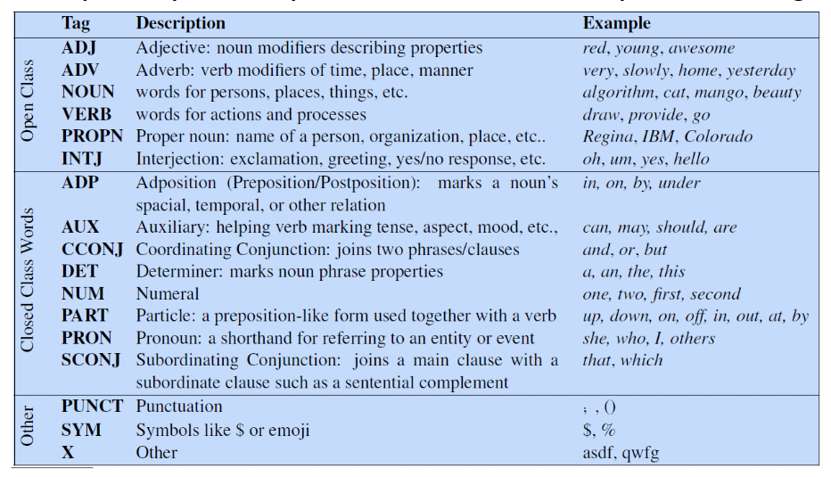

- [POS and NER: Sequence Labeling](#pos-and-ner-sequence-labeling)
  - [Parts of speech (POS)](#parts-of-speech-pos)
  - [Named Entity Recognition (NER)](#named-entity-recognition-ner)
  - [Sequence labeling:](#sequence-labeling)
- [POS Tagging](#pos-tagging)
  - [Why POS tagging is challenging?](#why-pos-tagging-is-challenging)

# POS and NER: Sequence Labeling
## Parts of speech (POS) 
The parts of speech (POS) refers to **word classes** such as Noun, Verb, Adjective, etc. 

It also known as lexical categories, word classes, morphological classes, lexical tags. Knowing word class tells us more about neighboring words and syntactic structure. E.g. nouns in English are often preceded by determiners and adjectives. Verbs have dependency links to nouns. POS tagging is a key aspect of parsing sentence structure.

## Named Entity Recognition (NER)
The named entity recognition (NER) is proper name for person, location, organization, etc. 

NEs are useful clues to sentence structure and meaning understanding. Knowing if a named entity like Washington is a name of person, a place, or a university is important to tasks like question answering and information extraction.

## Sequence labeling:
- **POS tagging** takes a sequence of words and assigns each word a POS like NOUN or VERB.
- **Named Entity Recognition (NER)** assigns words or phrases tags like PERSON, LOCATION, or ORGANIZATION.

# POS Tagging
There are multiple POS tagsets defined. For example, the following are 17 parts of speech in the Universal Dependecies tagset.

**Closed classes** are those with relatively **fixed membership**, such as prepositions; new prepositions are rarely coined.

Closed class words are generally **function words** (e.g. of, it, and) which tend to be very short, occur frequently, and often have structuring uses in grammar.

Nouns and verbs are maong **open classes**; new nouns and verbs like *iPhone* or *fax* are continually being created or borrowed.

**Prepositions** indicate spatial ot temporal relations, and relations.

**Determiners** like *this* and *that* can mark the start of article English noun phrase.

**Pronouns** acts as a shorthand for referring to an entity or event.
- **Persional pronouns** refer to person or entities (you, she, I, it, me, etc.)
- **Possessive pronouns** are forms of personal pronouns that indicate either actual possession ot more often just an abstract relation between the person and some object (my, your, his, her, its, one's, our, their, etc.)
- **Wh-pronouns** (What, who, whom, whoever, etc.) are used in certain question forms, or act as complementizers.

The 45-tag Penn Treebanc tagset is another tagset example.

Part-of-speech tagging is the process of assigning a part-of-speech to each word in a text.

## Why POS tagging is challenging?
Words are **ambiguous** -- have more than one possible part-of-speech. And the example words may contain multiple parts-of-speech. For example:
> **Book** that flight; Hand me that **book**.

> The **back** door; On my **back**; Win the voters **back**; Promised to **back** the bill.

